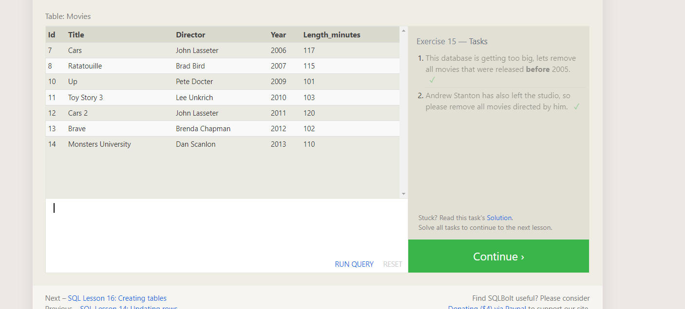
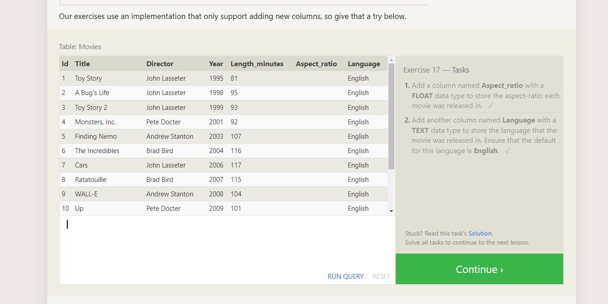

# Summary: Relational Databases and SQL

1. Introduction to Relational Databases:

Relational databases are a structured way of storing and organizing data in tables, where each table consists of rows and columns.

Tables are related to each other through common fields, establishing relationships that enable efficient data retrieval and manipulation.

2. SQL (Structured Query Language):

SQL is a powerful language used to communicate with relational databases, allowing users to perform various operations such as querying, updating, and deleting data.

Key SQL commands include:

SELECT: Retrieves data from a database based on specified criteria.

INSERT: Adds new data into a database.

UPDATE: Modifies existing data in a database.

DELETE: Removes data from a database.

SQL queries can filter data using the WHERE clause, sort results using the ORDER BY clause, and perform aggregate calculations using functions like COUNT, SUM, AVG, MIN, and MAX.

Joining tables using INNER JOIN, LEFT JOIN, RIGHT JOIN, and FULL JOIN allows combining data from multiple tables based on specified conditions.

3. Importance of Relational Databases and SQL:

Relational databases provide a structured and efficient way to store and manage large volumes of data, ensuring data integrity and consistency.

SQL serves as a universal language for interacting with databases, empowering users to extract meaningful insights from data through querying and analysis.

Understanding relational databases and SQL is essential for various fields including software development, data analysis, business intelligence, and more.

## Screenshots:

### SQL Queries Exercises

### DataBase Management

